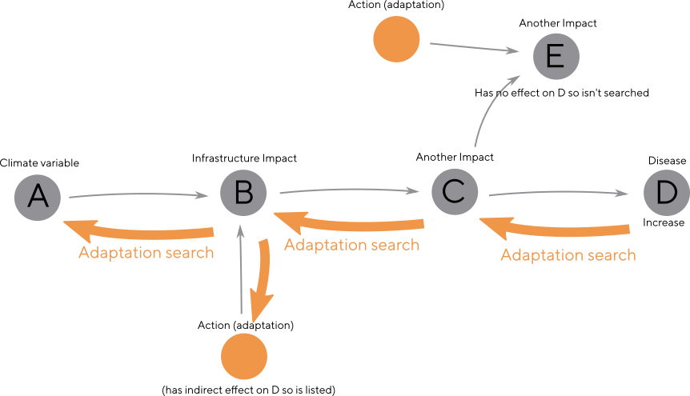

# LCAT impact network philosophy

1. Our aim is to provide the user with a customised list of health impacts and adaptations for their local area selection
2. We start with the climate data variables, which increase or decrease in different places and seasons and feed them into impacts to figure out if they increase or decrease
3. Where any two connections leading into a node disagree with each other (the evidence is contradictory) the result is uncertain
4. Uncertain nodes cause all following nodes to be uncertain
5. We only show adaptations where they have a known positive effect on health outcomes in their local area
6. We do not show adaptations where we don't know what their health impacts will be

This document refers to the [code found here](../client/src/core/NetworkParser.js).

# Our use of mDPSEEA definitions 

Some examples of how we are defining terms for LCAT:
   
* Drivers: causes of climate change (e.g. Burning fossil fuels).
* Pressures: specific climate variables that are changing (e.g. Temperature, Rainfall).
* States: something changed/caused by a pressure (e.g. Heatwaves, river water temperature, railway problems).
* Exposures: a secondary impact of a state change: (e.g. Individuals exposed to high heat, Cooling water potential).
* Effects: an 'end result' - often health related: (e.g. Respiratory deaths, Biodiversity & ecological balance disruption).
* Actions: Adaptations that can be applied to any of the above (e.g. Heatwave warning systems, promote uptake of electric vehicles).
        
## 1. Positive and negative correlation

Some assumptions (are these actually correct!):

* Climate variables (Pressures) can increase or decrease for a region
  selected by the user (we are not using thresholds or magnitudes).
* The States, Exposures and Effects they are connected to also
  increase or decrease.
* We can predict these changes by using the connections between them
  (from the scientific evidence) as positive or negative correlations.    
* The networks below could include Pressures, States, Exposures or
  Effects - they are all treated the same way.
* Currently Drivers (things causing climate change) and Actions
  (adaptation strategies) are not part of this calculation.
    
Examples:
        

On the left are positive correlations, where the increases/decreases
match: An increase in rainfall in this area (A) *increases* the
happiness of ducks (B), therefore underneath, a decrease in rainfall
elsewhere (A) *decreases* the happiness of ducks (B).

On the right are negative correlations, where they are inverted: A
rise in temperature (A) *decreases* the time it takes for ice cream to
melt in this area (B), therefore a fall in temperature (A) *increases*
melting time (B).

## 2. Chaining together impacts

Impacts can be chained together simply matching rise/fall (+) or
inverting (-) each other.

Examples:

* Increase in rainfall (A) leads to more ducks (B), decreasing the amount of bread (C).
* Decrease in rainfall (A) leads to fewer ducks (B), increasing the amount of bread (C).

## 3. Multiple connections coming into an impact

When multiple connections come into an impact we need to check that
they agree. Agreement is dependant on whether the upstream impact is
increasing or decreasing in combination with the correlation being
positive or negative.

The bottom two examples show disagreements, where we can't be certain
whether the impact is increasing or decreasing.
            

Uncertainties may due to:

1. Not breaking evidence down into enough nodes and connections
2. An indication that more research is needed to be done
3. Actually uncertain, and needing to be communicated to the user
    
## 4. Uncertainties lead to more uncertainty

Once we have an uncertain increase/decrease, all following impacts
have to become uncertain too. Dealing with uncertainty this way
(simply giving up as soon as we encounter some conflicting evidence)
is the most conservative (and simplest) approach. 

In future the best way we have discussed to counter uncertainty is for
these cases to be checked and 'overridden' when they are
uncertain. This will act like a default setting - with documentation
and evidence: "Although we have contradictory evidence for this
impact, based on <this reference> we have evidence that it will <increase
or decrease>".
    
## 5. Finding adaptations for health and wellbeing impacts

Once we have tagged all the nodes in the network with increase,
decrease or uncertain our next job is to search for adaptations that
will improve health and wellbeing outcomes.

We firstly build a list of the health impacts that are getting
'worse', which may be indicated either by an increase e.g. in a
disease impact or a decrease e.g. in wellbeing impacts.

The adaptations (action nodes) themselves are mostly not connected or
associated directly with the health impacts however, so for each of
the 'worse' health impacts we need to search backwards up through all
the nodes that we have evidence impacts on them, until we either loop
or come to an end point (usually the climate model variable).

By following nodes backwards, we only search impacts that we have
evidence have an effect on our health impact - no matter how distant
it is. This has the nice side effect of being able to show in the tool
the reason we are suggesting an adaptation, as both the direct effect
and indirect health benefit can be shown - along with the original
climate change causation.

## 6. Reasons that impacts may not be shown in the map after importing from Kumu

1. The "chain" they are part of does not originate in a Pressure we
have data for. We can only show impacts if we can tell the user if
they are increasing, decreasing or uncertain in the area they have
selected. We can't provide global data for these, as they may be wrong
(e.g. population level changes increasing when the user has selected
only the Isles of Scilly). However, these are still important to be be
collected in the Kumu map, as they are indications that we need to
find geolocated data for a specific climate, environmental or
socioeconomic variable. Once added they will appear automatically.

2. A connection between two impacts is not a + or a - type. It is only
possible to support positive or negative correlation. All following
impact nodes (if they have no other contributing connections)
therefore can't be shown either. This is still useful to use as a
placeholder though, when building the network in Kumu.

## 7. Reasons that adaptations are not shown in the list

1. The health impact(s) at the end of the chain they are part of is
uncertain or decreasing. This means we can't be sure that they will
improve any health or wellbeing impacts in this area. This is the tool
working as designed, as we are aiming to provide specific advice for
very local regions.

2. There is no health impact at the end of the chain of impacts they
are part of. This means we can't be sure that they are of benefit to
health and wellbeing. This can be fixed by providing a
reference/connection to a health and wellbeing impact.
