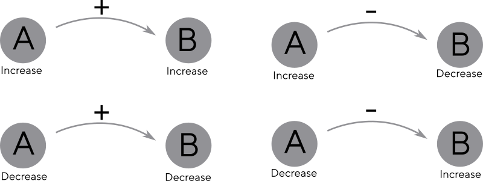
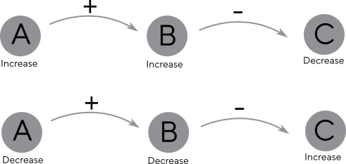
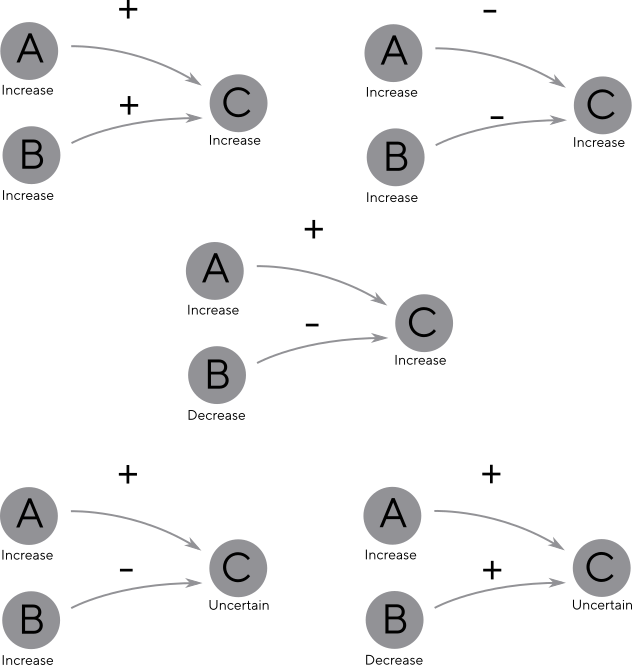
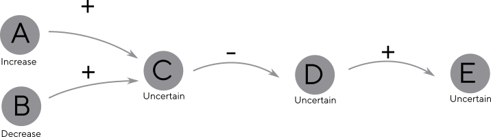
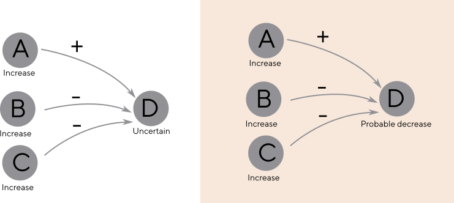
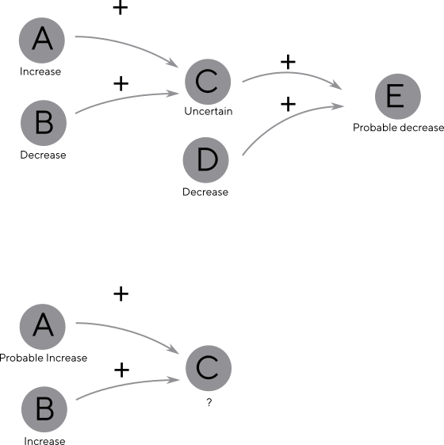

# How the climate data for a selected region is currently passed through the impact network

How impacts are currently calculated around our network of mDPSEEA
nodes, from climate variables through to health impacts. This is
currently under development - so the initial goal is to make sure we
are doing this correctly, after which it can be used as documentation.

This document refers to the [code found here](../client/src/core/NetworkParser.js).
   
## 1. Positive and negative correlation

Some assumptions (are these actually correct!):

* Climate variables (Pressures) can increase or decrease for a region
  selected by the user (we are not using thresholds or magnitudes).
* The States, Exposures and Effects they are connected to also
  increase or decrease.
* We can predict these changes by using the connections between them
  (from the scientific evidence) as positive or negative correlations.    
* The networks below could include Pressures, States, Exposures or
  Effects - they are all treated the same way.
* Currently Drivers (things causing climate change) and Actions
  (adaptation strategies) are not part of this calculation.
    
Examples:
        

On the left are positive correlations, where the increases/decreases
match: An increase in rainfall in this area (A) *increases* the
happiness of ducks (B), therefore underneath, a decrease in rainfall
elsewhere (A) *decreases* the happiness of ducks (B).

On the right are negative correlations, where they are inverted: A
rise in temperature (A) *decreases* the time it takes for ice cream to
melt in this area (B), therefore a fall in temperature (A) *increases*
melting time (B).

## 2. Chaining together impacts

Impacts can be chained together simply matching rise/fall (+) or
inverting (-) each other.

Examples:

* Increase in rainfall (A) leads to more ducks (B), decreasing the amount of bread (C).
* Decrease in rainfall (A) leads to fewer ducks (B), increasing the amount of bread (C).

## 3. Multiple connections coming into an impact

When multiple connections come into an impact we need to check that
they agree. Agreement is dependant on whether the upstream impact is
increasing or decreasing in combination with the correlation being
positive or negative.

The bottom two examples show disagreements, where we can't be certain
whether the impact is increasing or decreasing (worth noting that so
far in the data this only occurs once).
        

## 4. Uncertainties lead to more uncertainty

Once we have an uncertain increase/decrease, all following impacts
have to become uncertain too.

## 5. Ways to reduce uncertainty

Originally we talked about reducing this uncertainty by adding two
more states: probable increase/decrease (this is not done yet, but it
can be added). The inputs "vote" to indicate a majority decrease. This
does not solve a 50/50 split of course, so uncertainties are still
possible, *and it assumes the confidence and impact size is equal for
each connection*.
    

## 6. Future cases I'm not sure how do deal with

1. Should we use "probable" to add certainty to a previously uncertain state?
2. What should we do if we need to add together a probable state with a certain one?

